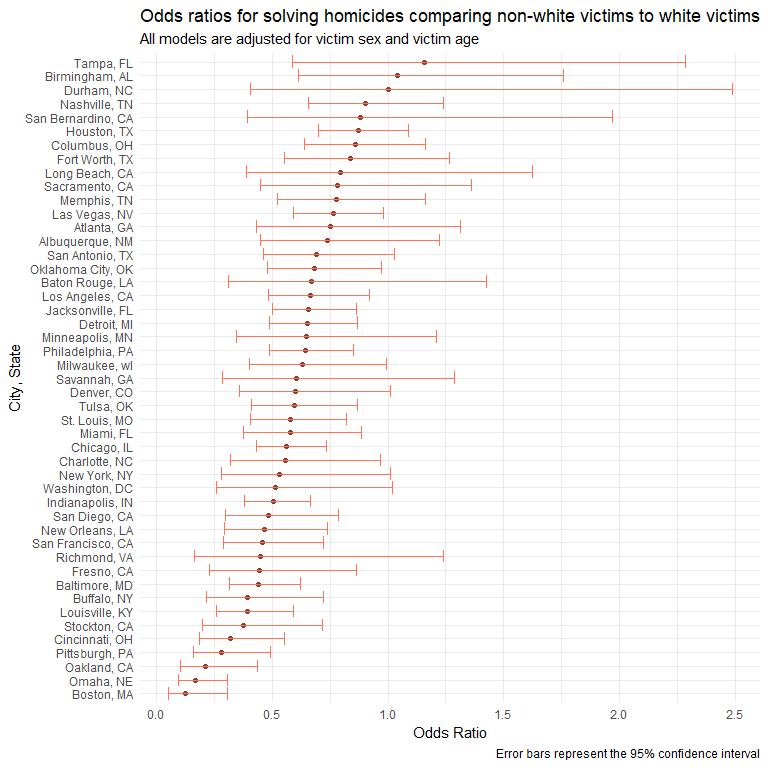

P8105 Homework 6
================
Stephanie Izard

Problem 1
---------

### Reading and manipulating the dataframe:

-   Created variable "city\_state" to include both city and state
-   Created binary variable "resolved" to indicate whether the homicide is solved or unsolved (1 = solved, 0 = unsolved)
-   Omitted cities Dallas, TX; Phoenix, AZ; and Kansas City, MO because these locations don’t report victim race
-   Omitted Tulsa, AL because this is a data entry mistake
-   Modified variable "victim\_race" to have categories white and non-white, with white as the reference category
-   Made sure the variable "victim\_age" was numeric

``` r
homicide_data <- read_csv("./data/homicide-data.csv", na = c("", "NA", "Unknown")) %>%
  janitor::clean_names() %>% 
  mutate(
    city_state = str_c(city, state, sep = ", "),
    victim_race = case_when(
      victim_race == "Asian" ~ "non-white",
      victim_race == "Black" ~ "non-white",
      victim_race == "Hispanic" ~ "non-white",
      victim_race == "Other" ~ "non-white",
      victim_race == "White" ~ "white")) %>% 
  mutate(
    resolved = as.numeric(disposition == "Closed by arrest"),
    victim_age = as.numeric(victim_age),
    victim_race = fct_relevel(victim_race, "white")
  ) %>% 
  filter(city_state != "Dallas, TX", 
         city_state != "Phoenix, AZ", 
         city_state != "Kansas City, MO", 
         city_state != "Tulsa, AL") %>% 
  select(-victim_first, -victim_last)
```

    ## Parsed with column specification:
    ## cols(
    ##   uid = col_character(),
    ##   reported_date = col_integer(),
    ##   victim_last = col_character(),
    ##   victim_first = col_character(),
    ##   victim_race = col_character(),
    ##   victim_age = col_integer(),
    ##   victim_sex = col_character(),
    ##   city = col_character(),
    ##   state = col_character(),
    ##   lat = col_double(),
    ##   lon = col_double(),
    ##   disposition = col_character()
    ## )

### Fitting a logistic regression model to Baltimore, MD:

-   Outcome: resolved vs unresolved (case\_status)
-   Predictors: victim age (victim\_age), sex (victim\_sex), and race (victim\_race)

``` r
baltimore_df <- homicide_data %>% 
  filter(city_state == "Baltimore, MD")

baltimore_fit <- baltimore_df %>% 
  glm(resolved ~ victim_age + victim_sex + victim_race, data = ., family = binomial())

baltimore_fit %>% 
  broom::tidy() %>% 
  mutate(OR = exp(estimate),
         ci_lower = exp(estimate - 1.96*std.error),
         ci_upper = exp(estimate + 1.96*std.error)) %>% 
  filter(term == "victim_racenon-white") %>% 
  select(OR, ci_lower, ci_upper) %>% 
  rename("Odds Ratio" = OR,
         "95% CI Lower Bound" = ci_lower,
         "95% CI Upper Bound" = ci_upper) %>% 
  knitr::kable(digits = 3)
```

|  Odds Ratio|  95% CI Lower Bound|  95% CI Upper Bound|
|-----------:|-------------------:|-------------------:|
|       0.441|               0.313|                0.62|

### Fitting a logistic regression model for all cities:

``` r
homicide_data_glm <- homicide_data %>% 
  group_by(city_state) %>% 
  nest() %>% 
  mutate(models = map(data, ~glm(resolved ~ victim_age + victim_sex + victim_race, data = .x, family = binomial())),
         models = map(models, broom::tidy)) %>% 
  select(-data) %>% 
  unnest() %>% 
  mutate(OR = exp(estimate),
         ci_lower = exp(estimate - 1.96*std.error),
         ci_upper = exp(estimate + 1.96*std.error)) %>% 
  filter(term == "victim_racenon-white") %>% 
  select(city_state, OR, ci_lower, ci_upper) 

homicide_data_glm %>% 
  rename(City = city_state,
         "Odds Ratio" = OR,
         "95% CI Lower Bound" = ci_lower,
         "95% CI Upper Bound" = ci_upper) %>% 
  knitr::kable(digits = 3)
```

| City               |  Odds Ratio|  95% CI Lower Bound|  95% CI Upper Bound|
|:-------------------|-----------:|-------------------:|-------------------:|
| Albuquerque, NM    |       0.739|               0.447|               1.223|
| Atlanta, GA        |       0.753|               0.432|               1.313|
| Baltimore, MD      |       0.441|               0.313|               0.620|
| Baton Rouge, LA    |       0.668|               0.313|               1.425|
| Birmingham, AL     |       1.039|               0.615|               1.756|
| Boston, MA         |       0.127|               0.052|               0.307|
| Buffalo, NY        |       0.392|               0.214|               0.719|
| Charlotte, NC      |       0.558|               0.321|               0.969|
| Chicago, IL        |       0.562|               0.431|               0.733|
| Cincinnati, OH     |       0.318|               0.184|               0.551|
| Columbus, OH       |       0.861|               0.638|               1.161|
| Denver, CO         |       0.602|               0.359|               1.009|
| Detroit, MI        |       0.652|               0.488|               0.870|
| Durham, NC         |       1.003|               0.404|               2.489|
| Fort Worth, TX     |       0.838|               0.555|               1.266|
| Fresno, CA         |       0.445|               0.229|               0.864|
| Houston, TX        |       0.873|               0.699|               1.090|
| Indianapolis, IN   |       0.505|               0.382|               0.667|
| Jacksonville, FL   |       0.658|               0.502|               0.862|
| Las Vegas, NV      |       0.763|               0.592|               0.982|
| Long Beach, CA     |       0.794|               0.388|               1.626|
| Los Angeles, CA    |       0.666|               0.483|               0.918|
| Louisville, KY     |       0.392|               0.259|               0.593|
| Memphis, TN        |       0.778|               0.521|               1.162|
| Miami, FL          |       0.577|               0.376|               0.885|
| Milwaukee, wI      |       0.632|               0.403|               0.991|
| Minneapolis, MN    |       0.646|               0.345|               1.209|
| Nashville, TN      |       0.902|               0.656|               1.241|
| New Orleans, LA    |       0.467|               0.295|               0.738|
| New York, NY       |       0.532|               0.279|               1.012|
| Oakland, CA        |       0.213|               0.104|               0.435|
| Oklahoma City, OK  |       0.681|               0.478|               0.971|
| Omaha, NE          |       0.170|               0.094|               0.307|
| Philadelphia, PA   |       0.644|               0.486|               0.852|
| Pittsburgh, PA     |       0.282|               0.161|               0.493|
| Richmond, VA       |       0.447|               0.162|               1.238|
| San Antonio, TX    |       0.689|               0.461|               1.030|
| Sacramento, CA     |       0.781|               0.449|               1.359|
| Savannah, GA       |       0.605|               0.284|               1.288|
| San Bernardino, CA |       0.880|               0.393|               1.972|
| San Diego, CA      |       0.483|               0.298|               0.785|
| San Francisco, CA  |       0.458|               0.290|               0.723|
| St. Louis, MO      |       0.577|               0.406|               0.820|
| Stockton, CA       |       0.376|               0.196|               0.719|
| Tampa, FL          |       1.159|               0.587|               2.288|
| Tulsa, OK          |       0.596|               0.408|               0.869|
| Washington, DC     |       0.514|               0.260|               1.017|

### Plotting estimated ORs and CIs for each city:

-   Organized according to OR

``` r
homicide_data_glm %>%
  mutate(city_state = fct_reorder(city_state, OR)) %>% 
  group_by(city_state) %>%
  ggplot(aes(x = city_state, y = OR)) +
    geom_point(color = "coral4", size = 1.5) +
    geom_errorbar(aes(ymax = ci_lower, ymin = ci_upper), color = "coral1") +
    labs(x = "City, State",
         y = "Odds Ratio",
         title = "Odds ratios for solving homicides comparing black victims to white victims",
         subtitle = "All models are adjusted for victim sex and victim age",
         caption = "Error bars represent the 95% confidence interval") +
    coord_flip() +
    theme_minimal()
```



Comments: Tampa, FL, Birmingham, AL, and Durham, ND have the 3 highest odds ratio for solving homicides comparing black victims to white victims, adjusting for victim age and sex. Additionally, these 3 cities are the only cities with an OR estimate greater than 1.0, or having higher odds of solving a homicide with a black victim compared to solving a homicide with a white victim.

Problem 2
---------

#### Loading and cleaning the data:

-   List variables changed here

``` r
bw_df <- read_csv("./data/birthweight.csv") %>% 
  janitor::clean_names()
```

    ## Parsed with column specification:
    ## cols(
    ##   .default = col_integer(),
    ##   gaweeks = col_double(),
    ##   ppbmi = col_double(),
    ##   smoken = col_double()
    ## )

    ## See spec(...) for full column specifications.

``` r
glimpse(bw_df)
```

    ## Observations: 4,342
    ## Variables: 20
    ## $ babysex  <int> 2, 1, 2, 1, 2, 1, 2, 2, 1, 1, 2, 1, 2, 1, 1, 2, 1, 2,...
    ## $ bhead    <int> 34, 34, 36, 34, 34, 33, 33, 33, 36, 33, 35, 35, 35, 3...
    ## $ blength  <int> 51, 48, 50, 52, 52, 52, 46, 49, 52, 50, 51, 51, 48, 5...
    ## $ bwt      <int> 3629, 3062, 3345, 3062, 3374, 3374, 2523, 2778, 3515,...
    ## $ delwt    <int> 177, 156, 148, 157, 156, 129, 126, 140, 146, 169, 130...
    ## $ fincome  <int> 35, 65, 85, 55, 5, 55, 96, 5, 85, 75, 55, 55, 75, 75,...
    ## $ frace    <int> 1, 2, 1, 1, 1, 1, 2, 1, 1, 2, 1, 1, 1, 1, 1, 2, 1, 1,...
    ## $ gaweeks  <dbl> 39.9, 25.9, 39.9, 40.0, 41.6, 40.7, 40.3, 37.4, 40.3,...
    ## $ malform  <int> 0, 0, 0, 0, 0, 0, 0, 0, 0, 0, 0, 0, 0, 0, 0, 0, 0, 0,...
    ## $ menarche <int> 13, 14, 12, 14, 13, 12, 14, 12, 11, 12, 13, 12, 13, 1...
    ## $ mheight  <int> 63, 65, 64, 64, 66, 66, 72, 62, 61, 64, 67, 62, 64, 6...
    ## $ momage   <int> 36, 25, 29, 18, 20, 23, 29, 19, 13, 19, 23, 16, 28, 2...
    ## $ mrace    <int> 1, 2, 1, 1, 1, 1, 2, 1, 1, 2, 1, 1, 1, 1, 1, 2, 1, 1,...
    ## $ parity   <int> 3, 0, 0, 0, 0, 0, 0, 0, 0, 0, 0, 0, 0, 0, 0, 0, 0, 0,...
    ## $ pnumlbw  <int> 0, 0, 0, 0, 0, 0, 0, 0, 0, 0, 0, 0, 0, 0, 0, 0, 0, 0,...
    ## $ pnumsga  <int> 0, 0, 0, 0, 0, 0, 0, 0, 0, 0, 0, 0, 0, 0, 0, 0, 0, 0,...
    ## $ ppbmi    <dbl> 26.27184, 21.34485, 23.56517, 21.84508, 21.02642, 18....
    ## $ ppwt     <int> 148, 128, 137, 127, 130, 115, 105, 119, 105, 145, 110...
    ## $ smoken   <dbl> 0.000, 0.000, 1.000, 10.000, 1.000, 0.000, 0.000, 0.0...
    ## $ wtgain   <int> 29, 28, 11, 30, 26, 14, 21, 21, 41, 24, 20, 31, 23, 2...

The hypothesized model will be based of a hypothesized structure for the factors that underly birthweight.

-   Outcome: birthweight
-   Main exposure: length
-   Covariates: gestational age in weeks (gest\_age), mother's weight gain during preganncy (wt\_gain)
